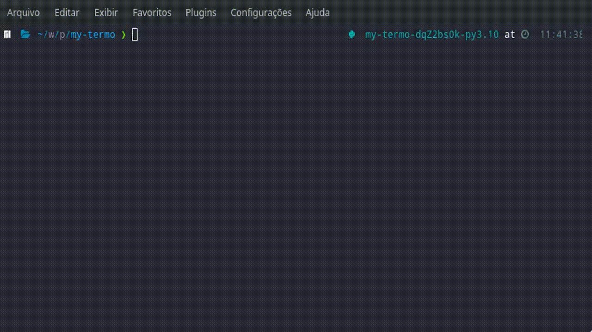

# my-termo



This is a simple Termo application in command line style. This app run a Linux crontab task every day to get a new word. Type termo in your terminal to guess the daily word 😄😄😄 

## Install ✨
To install termo command line type this
```shell
pip install my-termo
```

## Development Instructions ⚒️

Follow the below instructions to collaborate or run in development mode

### Dependencies 🧒
* `poetry` 
* `python`

### Running 🏃

To install type this command
```shell
poetry install
```

Run termo
```shell
termo
```

## Collaborate 💛💛💛

Send issues or insights.